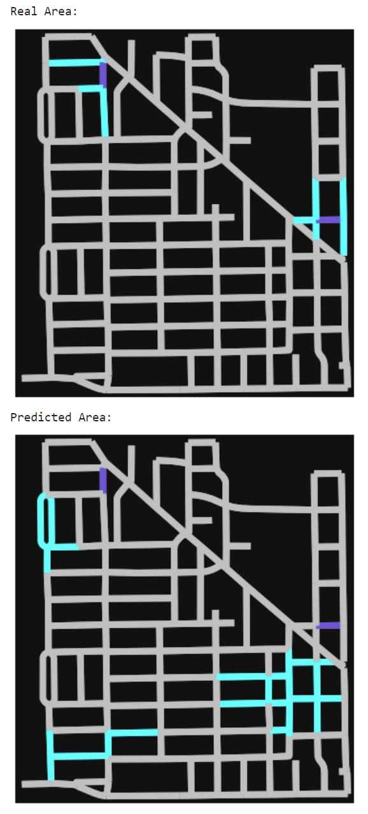

# Multi-Label-Classification
ML and DL approaches to predict flood in an urban area

### Summary

In Houston, TX, we are facing a challenge with flooding in an urban area. To tackle this issue, we are looking to develop a machine learning model capable of predicting the outcome of flood events based on their initial conditions. We have a collection of 3,000 simulated flood incidents (training set), each serving as a historical data point to train our model.

### Dataset

Here you can see a sample image from the area(it's an elevation map of area):

<!--  -->

You can find a complete dataset for this project here:
[Dataset](https://drive.google.com/drive/folders/1JqYgHdtN7MsMO2df0E2LSJk3K323sRun?usp=sharing)

### Explanation
Complete Explanation of project could be found in the file, "Project Description.pdf"  
The project consists of three parts:
1. Preprocessing data
2. ML classic approaches
3. Deep Learning approach

### How to use:
1. Just simply open the code
2. Correct the links to the dataset and models
3. Run the code

### Results

Since the data is imbalance, the metric which is important here is recall!

Results of the classic models: 
Best result was for decision tree with the recall of 39%, which is not good at all.

Result of the MLP model: 
It reached 68% recall for the test data, which is a great improvement compared to clssic approaches!
Final visualized result:

<!--  -->

